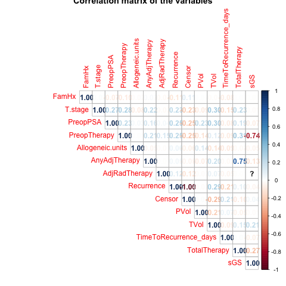
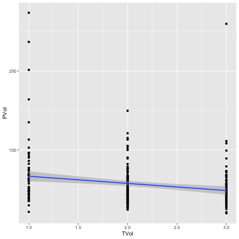
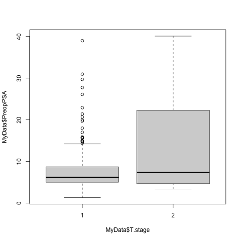
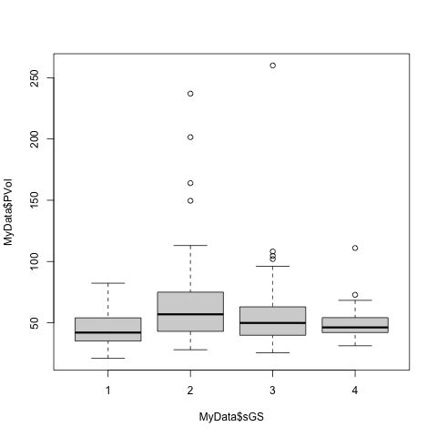
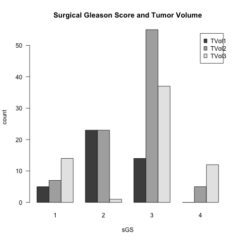
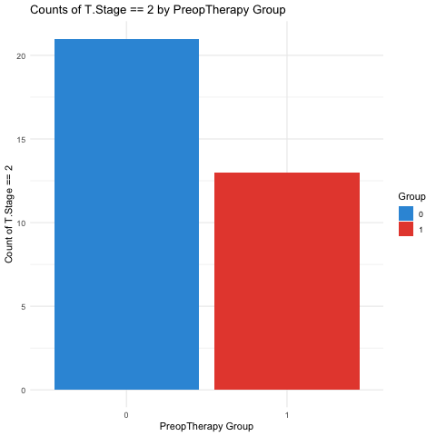

<style type="text/css">

body, td {
   font-size: 18px;
}
code.r{
  font-size: 12px;
}
pre {
  font-size: 12px
}
</style>

```{r setup, include=FALSE}
knitr::opts_chunk$set(echo = FALSE)
```

<br>
<br>

## **Introduction**

The main objective of this group project was to put knowledge from the course (RMED901) into practice. The group was given a set of different tasks to be solved individually or in collaboration. The tasks included coding by using RStudio, tidying and wrangling data, creating plots and finally analyze the results. A repository created on GitHub was used for collaboration and version control.<br>
<br>
<br>

## **GitHub Repository**

First we created a Rprojects in RStudio, and then a GitHub Repository. The latter made it possible to store and share script/files, and also track revision history:<br>
https://github.com/MarianneHannisdal/GROUP3 <br>
<br>
The repository contains the following main folders:<br>
<br>

- DATA (original and tidied dataset/original and updated codebook)<br>
- SCRIPTS (code used for tidying, creating plots and analyzing the data)<br>
- RESULTS (final report)<br>
<br>
<br>


## **Datasource**
<br>
The original data set is mainly from Cata et al. ’Blood Storage Duration and Biochemical Recurrence of Cancer after Radical Prostate- ctomy’. Mayo Clin Proc 2011; 86(2): 120-127.<br>

From the description on package website: “This data set contains data on 316 men who had undergone radical prostatectomy and received transfusion during or within 30 days of the surgical procedure and had available prostate serum antigen (PSA) follow-up data. The main exposure of interest was RBC storage duration group.”<br>

To be able to tidy, adjust and explore, the group received a dataset that was not in a tidy format anymore.<br>

We started by exploring the data, and quickly noticed that:<br>
<br>
1) the dataset did not contain 316 rows, but 672<br>
2) the column names did not have optimized naming<br>
3) some rows contained variables, and some variables were observations #untidy!!<br>

<br>

Based on this, we started tidying so that every column became a variable and every row became an observation.<br>
<br>

## **Tidy the data**

To tidy the "exam.dataset.txt", we had to:<br>

- remove duplicated rows
- rename columns that contain spaces, punctuation signs or start with numbers (e.g.'X1_Age' to 'Age') 
- rename columns to more intuitive names (e.g. 'Units' to 'Allogeneic.units')
- separate columns (e.g. 'subject' to 'subject' + 'Hospital')
- reshape values in columns including various measurements (e.g. 'TimeToRecurrence-unit' into days)<br>
<br>
Then the tidy dataset was saved as "tidy_exam_dataset.txt" <br>
<br>

## **Adjust/manipulate/wrangle the data**

To adjust the "tidy_exam_dataset.txt" we had to:<br>

- remove unnecessary columns from the dataframe ('AA', 'bGS' 'BNplus' and 'OrganConfined)
- change variable types ('subject' from character to numeric)
- create a set of new columns (e.g. 'recurrence' to return the values Yes or No) 
- change and arrange the order of some columns 
- organize the R code in a pipe
- join an additional dataset to the tidied dataset<br>
<br>
Now, the new file contains 316 number of observations and 21 number of variables.<br>
The tidied and manipulated dataset was saved in a new file "tidy_adjust_exam_dataset.txt" and the codebook was updated.<br>
<br>

## **Exploratory data analysis (EDA) of the data**

To explore the data, we did the following:<br>

- count columns with missing variables (number of columns containing NA = 7)
- stratify the data by a categorical column ('TimeToRecurrence_days' grouped by 'T.stage') 
- calculate minimum and maximum levels, mean and sd for several conditions and create a table<br>
<br>

All the scripts were eventually styled by using [{styler}](https://styler.r-lib.org/).<br>
A README file was written to document the contents and structure of the repository on GitHub.<br>
<br>
<br>

## **Create plots**
In this chapter we would like to present some of the plots we created to answer questions given in the exam description. <br>

**Correlation matrix**
<br>
First we checked if there were any correlated measurements whitin the variables by computing a correlation matrix. <br> 
Here, the numbers tell the correlation, and the color indicates if it is negative(red) or positive(blue), and the opacity of the number indicates the degree of correlation (strong color=strong correlation): <br>
```{r}



```
<br>
<br>
<br>
**Is there a relation between `PVol` and `TVol`**
<br>
We calculated the correlation and found that there is a negative correlation between PVol and TVol of -0,21, meaning that for every 1 TVol increases, PVol decreases with 0.21. This is illustrated with the regression line in the plot below: <br>

```{r fig.cap="Regression line showing the relationship between PVol and TVol"}

```
<br>
<br>
<br>
**Does the distribution of `PreopPSA` depend on `T.Stage`?**
<br>
We computed a Welch Two Sample t-test, showing a p-value of 0,01, indicating there is a significant difference in mean`PreopPSA`  between the `T.Stage` groups. The distribution of observations are illustrated in the boxplot below: <br>

```{r}


```
<br>
<br>
<br>
**Does the distribution of `PVol` depend on `sGS`** 
<br>
First we visually inspected the distribution of sGS groups PVols, respectively in a boxplot (se below). Next, we conducted ANOVA analysis which turned P-value (Pr(>F)): 0.00434, indicating strong statistical significance. This suggests that the differences in PVol across the sGS groups are statistically significant and unlikely to have occurred by chance. <br>

```{r}


```
<br>
<br>
<br>
**Does the distribution of `TVol` depend on `sGS?**
<br>

We computed a plot (see below) and calculated ANOVA which turned a p-value (Pr(>F)) of 3.39e-11 - . The p-value indicates the probability of observing such a strong association between sGS and TVol by chance alone, under the null hypothesis that sGS has no effect on TVol. The p-value is extremely small, providing strong evidence against the null hypothesis, suggesting that the differences in TVol across the groups defined by sGS are highly statistically significant
<br>

```{r}


```
<br>
<br>
<br>
**Are there more `T.Stage == 2` in the group with `PreopTherapy == 1` than in the group `PreopTherapy == 0`?**
<br>
We plotted the counts of T.Stage == 2 by PreopTherapy group, and found there were most T.Stage==2 in the group "PreopTherapy == 0". Perhaps this cpould indicate that those who didnt recieve preoperative therapy had hinger T.Stage (more severe disease).
<br>

```{r}


```
<br>
<br>
<br>

## **Analyzing the data**

<br>

**Was the time to recurrence different for various `RBC.Age.Group` levels?**
<br>
Write here..
<br>
<br>

**Was the time to recurrence different for various `T.Stage` levels?**
<br>
Write here..
<br>
<br>

**Did having `AdjRadTherapy` affect time to recurrence?**
<br>
Write here..
<br>
<br>

**Did those that had recurrence had also larger `TVol` values than those without recurrence?**
<br>
Write here..
<br>
<br>

## **Conclusion**

<br>
Write here...
<br>
<br>

Note that the `echo = FALSE` parameter was added to the code chunk to prevent printing of the R code that generated the plot.
